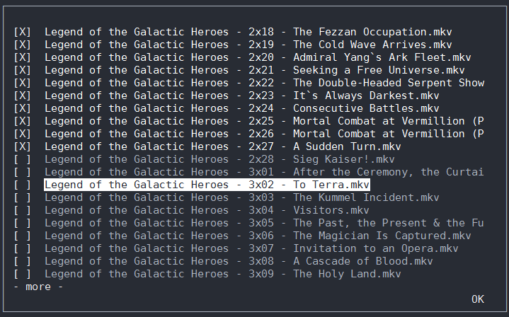

# Series Tracker

Track which episodes of a series you've already seen.



### Prerequisites

You can either run [series_tracker.exe](dist/series_tracker.exe) or run the script manually.


You will need and npyscreen to run this script.

```
pip install npyscreen
```

If you want to run the script manually under windows, you will need to install an unofficial curses .whl from here [unofficial curses for windows](https://www.lfd.uci.edu/~gohlke/pythonlibs/#curses)
